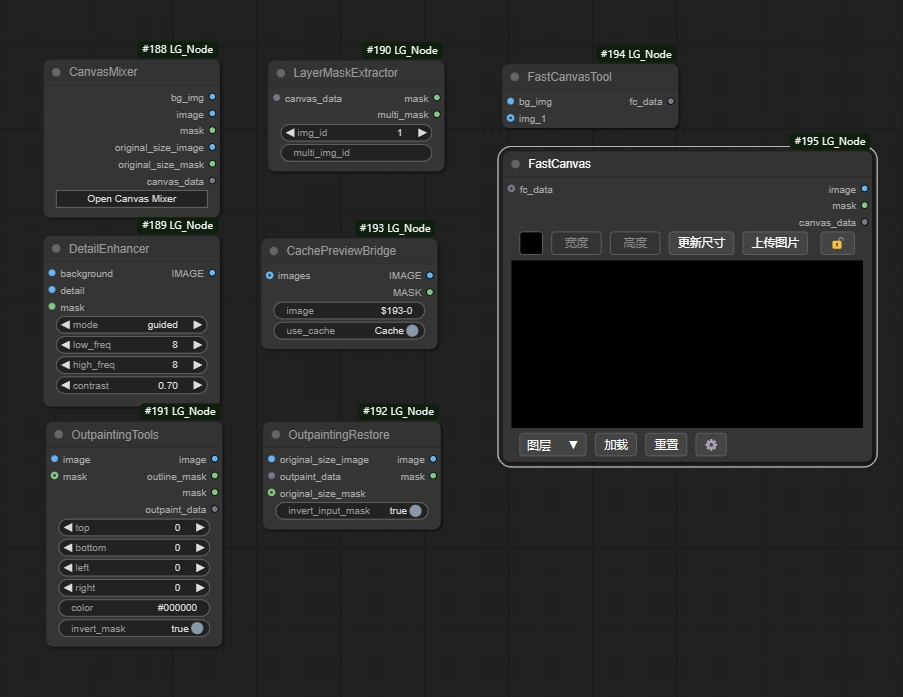
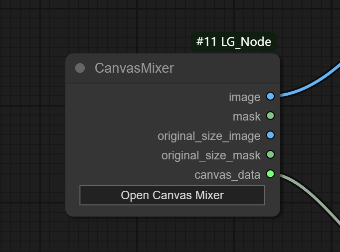
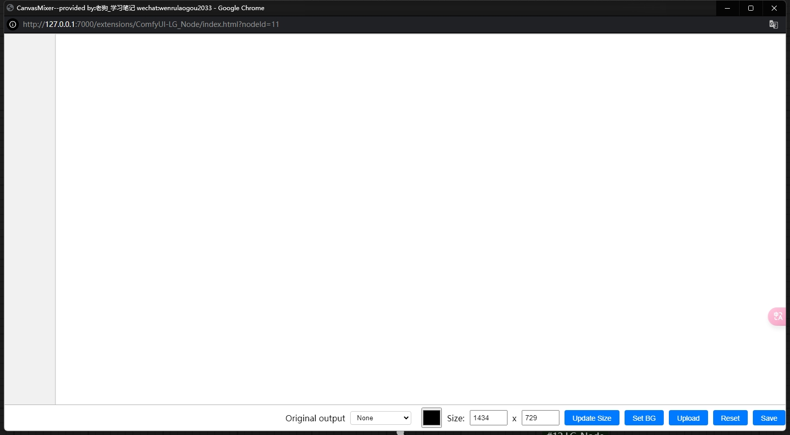
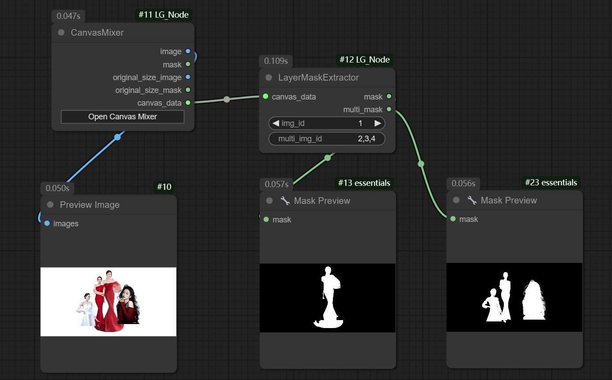
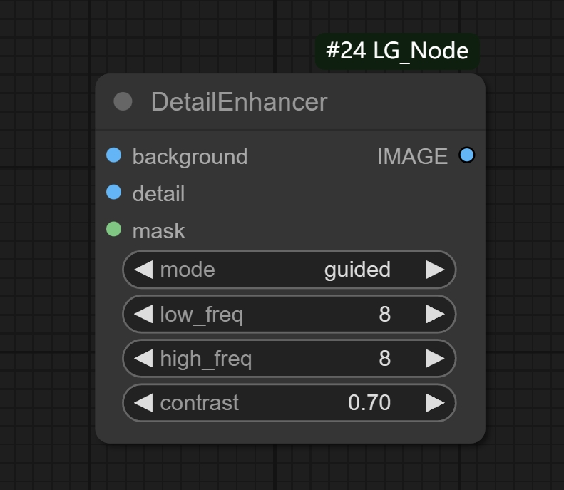
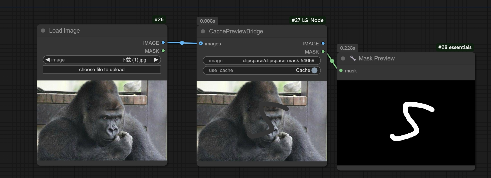
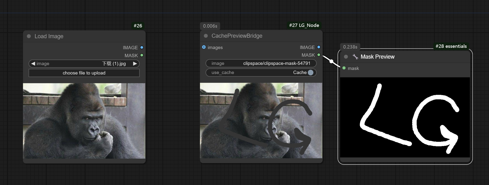
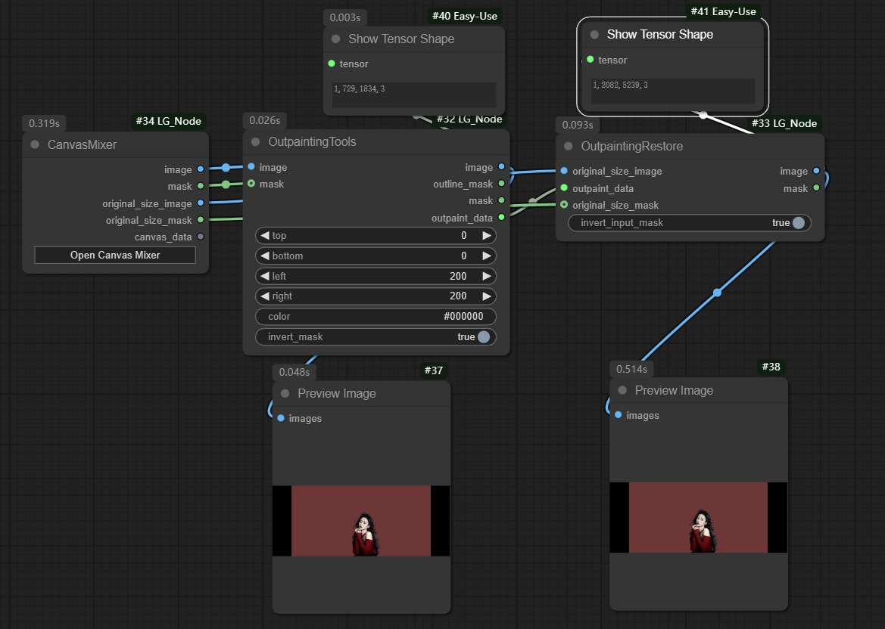

# ComfyUI-LG_Node



**这是一个用于构图和恢复细节的工具包，它简化了繁琐的计算步骤，并优化了性能，让我们在处理高分辨率图像的时候能够做到不丢失原本的细节并且大大提升了效率**


## 节点

### CanvasMixer



**CanvasMixer** 是一个用于合并多个图像的工具，它可以将多个图像拼接在一起，并自动调整每个图像的位置，以便于在一个画布上查看。



> 该窗口按照当前窗口的0.6倍比例居中显示，方便查看
> 可以同时使用多个画布混合节点处理不同的任务
> 支持多种快捷操作，如：滚轮缩放，Delete删除图层，shift+鼠标左键多选，Alt+鼠标左键不改变图层顺序选中图层等
> 支持输出指定图层遮罩，以及同时输出多个图层遮罩进行分别处理

1.点击Open Canvas Mixer打开界面

2.点击Upload添加图像

```
添加了多种上传方式
*支持Upload批量上传
*支持批量拖拽上传
*支持Ctrl+V上传
```

3.点击Set BG设置当前图层为背景

4.点击Update Size 更新画布大小

```
*点击Update Size默认按照采样器通用尺寸规则，宽高整除8并向下取整，确保图片经过K采样器不会出现尺寸变化
*当宽或者高中的某一个设置为0的时候，采用按边放大原则
*尺寸输入框显示的是当前背景画布的实际尺寸
```

5.通过Original output选择指定图层，按照指定图层的原始尺寸输出整张图片

```
*对于不想要丢失原图的任何细节的用户来说，这点非常重要*
通过选择指定图层，将指定图层还原到原始的尺寸，并且背景画布等比例放大，并且图层的位置和当前画布上的保持一致
注意：当图层在画布中的缩放比例不能被1整除时，使用对比图像节点会产生细微的偏移
    （因为输出的尺寸必须是整数，而缩放比例不能被1整除时，通过计算得到的尺寸是非整数，图片会进行舍入处理，所以尺寸不能保持完全一致）
```

6.每个上传的图片会自动分配一个控制按钮以及编号，通过编号按钮可以调整图层的顺序，以及删除图层

```
支持点击图层按钮红X删除图层
支持Delete键删除图层
```

7.输出端口能够输出当前画布的实际尺寸图像，以及选中图层的遮罩

```
*image输出的是当前画布的实际尺寸图像
*mask输出的是选中图层的遮罩
*Original_size_image输出的是按照选中图层的原始尺寸输出的整张图片
*Original_size_mask输出的是按照选中图层的原始尺寸输出相对整张图片的遮罩
*canvas_data输出的是当前画布的遮罩数据，可以用于后续的节点处理
```

8.点击Save保存并关闭窗口


### LayerMaskExtractor



**LayerMaskExtractor** 是一个用于提取图层遮罩的工具，它可以将图层遮罩提取出来，并输出为遮罩图像。

> 它能够根据图层的id来提取指定图层的遮罩
> 支持输出指定图层的遮罩，以及同时输出多个图层遮罩进行分别处理
> 支持遮挡关系，当图层A被图层B遮挡时，图层A的遮罩会被图层B的遮罩遮挡


### DetailEnhancer



**DetailEnhancer** 是一个用于增强图像细节的工具，它可以通过多种模式来增强图像的细节。

> 该节点使用了高低频分离的原理，并进行了优化，在保持图像细节的同时，大大提升了性能
> 该节点在处理高分辨率图像的时候，能够做到不丢失原本的细节并且大大提升了速度，并且边缘部分的处理优于普通的细节还原节点，简化了操作


### CachePreviewBridge



**CachePreviewBridge** 是一个用于缓存预览图片和遮罩的工具

> 当你使用input模式将图片输入到节点后，编辑好遮罩然后点击Cache按钮，节点会缓存当前的图片和遮罩
> 在点击Cache按钮后，无论输入端口是否连接，是否刷新，都不会影响当前缓存的图片和遮罩，你可以继续在当前节点编辑遮罩并且不会重置缓存




### OutpaintingTools



**OutpaintingTools** 是一个用于外扩图片的工具，通过如上的连接，可以将图片进行外扩，并且还原指定图层原始尺寸的细节
>我将传统的繁琐的计算步骤进行了简化，现在无需添加过多的计算节点就能够完成原始尺寸的还原
>在计算速度上进行了优化，处理高分辨率的图像时，速度明显优于普通节点


## 计划
- 制作基于ComfyUI框架的画布混合节点，实现在界面内进行画布混合以及实时调整

# 联系我
如果你对这个节点感兴趣，请通过以下方式获取
- 微信：wenrulaogou2033
- 淘宝店铺ID：581345365
- 卖家: cx1242423036

一杯奶茶钱，即可获取该节点包，并且后续更新不再额外收费！

工作流可以不必复杂！
